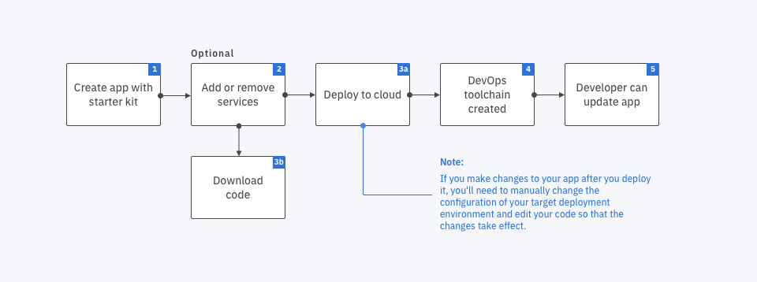

---

copyright:
  years: 2018, 2019
lastupdated: "2019-03-18"

keywords: apps, starter kit, Kubernetes, cluster

subcollection: creating-apps

---

{:shortdesc: .shortdesc}
{:new_window: target="_blank"}
{:codeblock: .codeblock}
{:pre: .pre}
{:screen: .screen}
{:tip: .tip}

# Kubernetes クラスターへのスターター・キット・アプリのデプロイ
{: #tutorial-starterkit-kube}

ブランクのスターター・キットと Kubernetes ツールチェーンを使用して {{site.data.keyword.cloud}} でアプリケーションを作成し、Kubernetes クラスター内のセキュアなコンテナーにアプリを継続的にデリバリーする方法について説明します。 コード変更が自動的にビルドされ、Kubernetes クラスター内にあるアプリに伝搬されるように、継続的統合 DevOps パイプラインを構成できます。 既にパイプラインがある場合は、それをアプリに接続できます。
{: shortdesc}

{{site.data.keyword.cloud_notm}} は、Kubernetes 上で実行されるアプリの基盤を構築するのに役立つスターター・キットを提供しています。 スターター・キットを使用すると、アプリ開発に関する {{site.data.keyword.cloud_notm}} ベスト・プラクティスを使用したクラウド・ネイティブ・プログラミング・モデルに容易に従うことができます。 スターター・キットは、クラウド・ネイティブ・プログラミング・モデルに従ったアプリを生成し、各プログラミング言語のテスト・ケース、ヘルス・チェック、およびメトリックを含んでいます。 また、生成されるアプリケーション内で初期化されることになるクラウド・サービスをプロビジョンすることもできます。

このチュートリアルでは、Kubernetes デプロイメント・ターゲットを使用します。 このチュートリアルでは、Java + Spring を使用して基本スターター・キットからアプリケーションを作成し、そこに Cloudant サービス・インスタンスを追加し、IBM Kubernetes Service を使用してそれを {{site.data.keyword.cloud_notm}} にデプロイします。

まず、以下のスターター・キットのフロー・ダイアグラムと、それに対応する概要ステップを参照してください。

 

## 始める前に
{: #prereqs-starterkit-kube}

* [スターター・キット](/docs/apps/tutorials?topic=creating-apps-tutorial-starterkit)を使用して、**Java + Spring** のアプリを作成します。
* [{{site.data.keyword.cloud_notm}} CLI](/docs/cli?topic=cloud-cli-ibmcloud-cli) をインストールします。
* [Docker ](https://www.docker.com/get-started){: new_window}  をセットアップします。

## アプリへのサービスの追加
{: #resources-starterkit-kube}

アプリケーションに {{site.data.keyword.cloud_notm}} サービスを追加します。 以下のステップで、Cloudant インスタンスをプロビジョンし、リソース・キー (資格情報) を作成し、それをアプリにバインドします。

1. **アプリの詳細**ページで、**「サービスの追加」**をクリックします。
2. **「データ」**を選択し、**「次へ」**をクリックします。
3. **「Cloudant」**を選択し、**「次へ」**をクリックします。
4. **「Cloudant の追加」**ページで、地域 (米国南部)、リソース・グループ (デフォルト)、および価格プラン (ライト - インスタンスが 1 つ無料) を選択します。
5. **「作成」**をクリックします。 **アプリの詳細**ページが表示され、Cloudant インスタンスがプロビジョンされ、アプリにバインドされます。 Cloudant リソース・キー (資格情報) が**「資格情報」**フィールドに追加されていることに注意してください。
6. オプション。 サービスを追加した後にアプリ・コードを素早く確認する場合は、**「コードのダウンロード」**をクリックします。 コードは、完全なアプリ・コード構成を含む `.zip` ファイルとしてダウンロードされます。 {{site.data.keyword.dev_cli_notm}} を使用して、ファイルを簡単に解凍し、コードをローカルで実行することができます。また、コード管理リポジトリーに追加することもできます。

## DevOps ツールチェーンを使用したアプリのデプロイ
{: #deploy-starterkit-kube}

DevOps ツールチェーンをアプリケーションに接続し、{{site.data.keyword.cloud_notm}} Kubernetes サービスでホストされている Kubernetes クラスターにデプロイされるように構成します。

1. **「アプリの詳細」**ページで**「継続的デリバリーの構成 (Configure continuous delivery)」**をクリックします。
2. **「デプロイメント・ターゲットの選択 (Select a deployment target)」**ページで**「IBM Kubernetes Service にデプロイ (Deploy to IBM Kubernetes Service)」**を選択します。
3. 地域とクラスターを選択します。 Kubernetes クラスターがない場合は、**「クラスターの作成」**をクリックします。
  * **「新規クラスターの作成」**ページで、ロケーション、クラスター・タイプ (無料) を選択し、クラスター名を入力し、**「クラスターの作成」**をクリックします。
  * 必要な場合、画面の指示に従ってクラスターにアクセスします。
  * ツールチェーンを作成するために、クラスターが**「作動可能」**と示されるまで待ちます。 **「米国南部」**地域では、無料のクラスターを 1 つプロビジョンできます。
  * **「デプロイメント・ターゲットの選択 (Select a deployment target)」**ページに戻ります。
4. **「次へ」**をクリックします。 **「ツールチェーンの構成」**ページが表示されます。
5. **「ツールチェーンの構成」**ページで、ツールチェーン名を入力し、地域を選択し、リソース・グループを選択してから**「作成」**をクリックします。 **アプリの詳細**ページが、ツールチェーンに関するデプロイメント情報と共に表示されます。

## リポジトリーの表示
{: #view-repo-starterkit-kube}

1. **アプリの詳細**ページで、**「リポジトリーの表示」**をクリックします。 スターター・キットが生成した Git リポジトリーが表示されます。
2. オプション。 画面の指示に従って、デスクトップに SSH を構成します。
3. オプション。 画面の指示に従って、アカウントの個人用アクセス・トークンを作成します。

## ツールチェーンのツール、ログ、および履歴の表示
{: #view-logs-starterkit-kube}

1. デプロイメント・ステージが終了すると、**アプリの詳細**ページが、ツールチェーンに関するデプロイメント情報と共に表示されます。
2. **「ツールチェーンの表示」**をクリックして、ツールチェーンにアクセスします。 ツールチェーン・ページの**「概説」**タブが表示され、ツールチェーンに含まれているツールが示されます。 この例では、ツールチェーンの作成時にスターター・キットで事前選択された以下のツールが含まれています。
  * プロジェクトの更新および変更を追跡する問題トラッカー。
  * アプリケーションのソース・コードを含んでいる Git リポジトリー。
  * アプリケーションを編集するための Web ベースの IDE である、Eclipse Orion インスタンス。
  * カスタマイズ可能なビルド・ステージとデプロイ・ステージで構成される Delivery Pipeline。
	 * ビルド・ステージは、アプリをコンテナー化します。 より具体的にいうと、ビルド・ステージは以下を実行します。
	   * GitLab リポジトリーを複製します。
	   * アプリをビルドします。
	   * Docker イメージをビルドします。
	   * イメージをプライベート・コンテナー・レジストリーに公開します。
	 * デプロイ・ステージは、コンテナー・レジストリーからコンテナー・イメージを取得し、それを Kubernetes クラスターにデプロイします。
3. **「Delivery Pipeline」**をクリックします。 パイプライン・ステージが表示されます。
4. **「デプロイ・ステージ」**タイルで、**「ログおよび履歴の表示」**をクリックします。

## アプリが実行中であることの確認
{: #verify-starterkit-kube}

アプリのデプロイ後に、Delivery Pipeline またはコマンド・ラインにアプリの URLが示されます。

1. DevOps ツールチェーンから、**「Delivery Pipeline」**をクリックし、**「デプロイ・ステージ」**を選択します。
2. **「ログおよび履歴の表示」**をクリックします。
3. ログ・ファイルで、アプリケーション URL を見つけます。

    ログ・ファイルの末尾で `View the application health at: http://<ipaddress>:<port>/health` を探します。

4. ご使用のブラウザーでその URL にアクセスします。 アプリが実行されている場合は、`Congratulations` または `{"status":"UP"}` を含むメッセージが表示されます。

コマンド・ラインを使用している場合は、[`ibmcloud dev view`](/docs/cli/idt?topic=cloud-cli-idt-cli#view) コマンドを実行して、アプリの URL を表示します。 次に、ブラウザーでその URL にアクセスします。

## 次のステップ
{: #next-steps-startkit-kube notoc}

* デプロイメントでエラーが発生した場合は、既知の問題に関するトラブルシューティング・トピック (例えば、[ストレージ割り当て量の超過](/docs/apps?topic=creating-apps-managingapps#exceed_quota)) を確認するか、[Kubernetes ログにアクセス](/docs/apps?topic=creating-apps-managingapps#access_kube_logs)して、エラーを探す方法を調べてください。

* コード内のサービス構成にアクセスします。
	- _@Value_ アノテーションを使用するか、Spring フレームワーク環境クラス _getProperty()_ メソッドを使用できます。 詳しくは、[資格情報へのアクセス](/docs/java-spring?topic=java-spring-configuration#accessing-credentials)を参照してください。

* 新しい資格情報を Kubernetes 環境に追加します。
	- DevOps ツールチェーンが作成された後に別のサービスをアプリケーションに追加した場合、それらのサービス資格情報は、デプロイ済みアプリケーションおよび GitLab リポジトリーに自動的には更新されません。 デプロイメント環境に[資格情報を手動で追加](/docs/apps?topic=creating-apps-add-credentials-kube)する必要があります。
